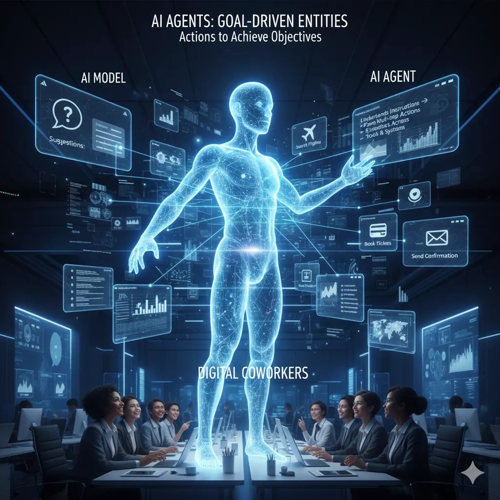

# AI Agent Workforce Platform

[](https://www.python.org/downloads/)
[](https://fastapi.tiangolo.com/)
[](https://aws.amazon.com/)
[](https://databricks.com/)
[](LICENSE)
[](CONTRIBUTING.md)

5 autonomous AI agents for production ML operations on AWS and Databricks.
Built for senior AI engineering roles at ASX200 enterprise companies.

---

### The Five Agents

| Agent | Role | Port |
|-------|------|------|
| 🛰️ Nova | Infrastructure — EKS, ECR, API Gateway | :8001 |
| ⚡ Axiom | Data Pipelines — Delta Lake, MLflow | :8002 |
| 🛡️ Sentinel | Testing & Red Team — pytest, Playwright | :8003 |
| 📖 Nexus | Documentation — OpenAPI, Runbooks | :8004 |
| ⚙️ Prometheus | Optimization — A/B Testing, Auto-scaling | :8005 |

---

### Quick Start

```bash
git clone https://github.com/quantumai101/ai-agent-platform.git
cd ai-agent-platform
cp config/.env.example config/.env
pip install -r config/requirements.txt
python deployment/launch_ui.py
```

Browser opens at `http://localhost:3000` — click **Deploy Agents** to launch all five.

---

### Project Structure

```
ai-agent-platform/
├── agents/          # Nova, Axiom, Sentinel, Nexus, Prometheus
├── orchestration/   # Central coordinator (port 8000)
├── monitoring/      # Prometheus metrics, Sentinel alerts
├── deployment/      # Launch scripts, Docker, Kubernetes
├── config/          # Environment variables, requirements
├── frontend/        # Browser UI
├── docs/            # Full documentation + index.html
└── tests/           # Unit, integration, red-team suites
```

---

### Full Documentation

See [docs/README.md](docs/README.md) for the complete guide, or open [Live Web Version](https://quantumai101.github.io/ai-agent-platform-databricks-on-aws/) for the web version.

---

MIT License · [quantumai101](https://github.com/quantumai101)


